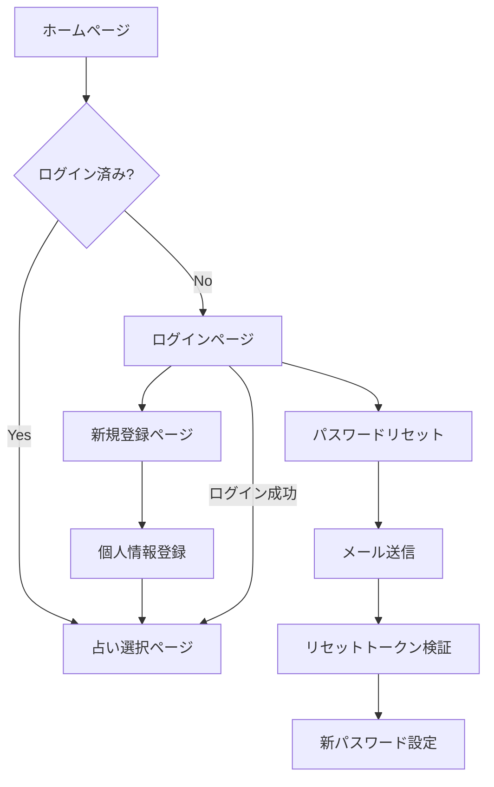
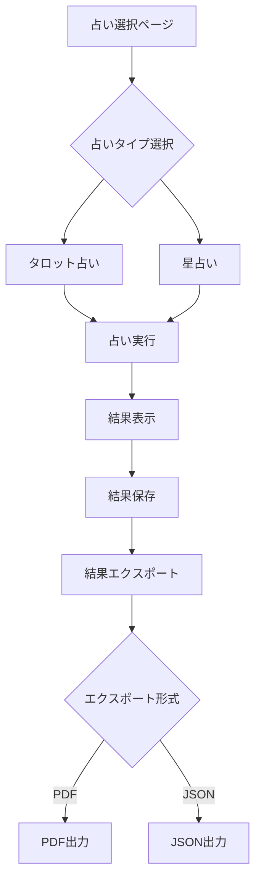
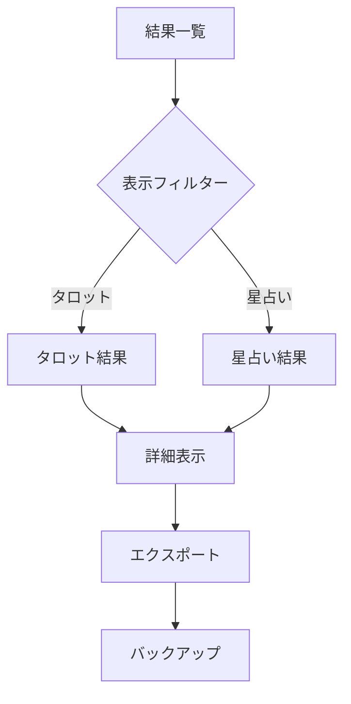
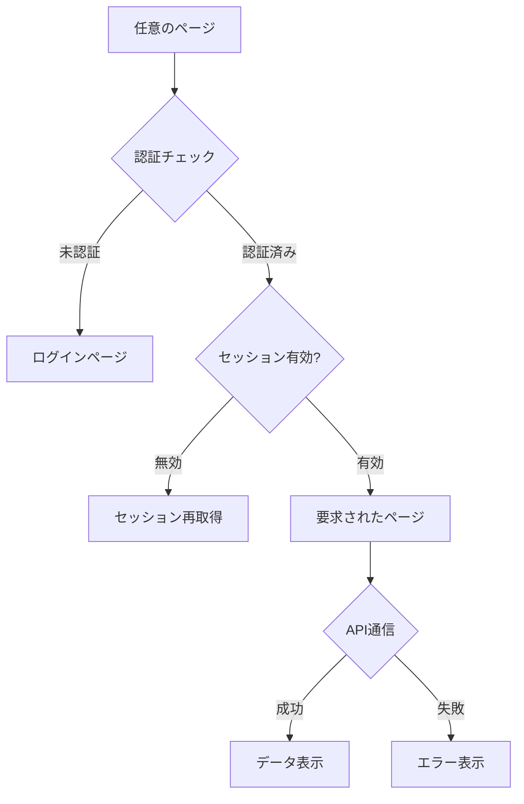
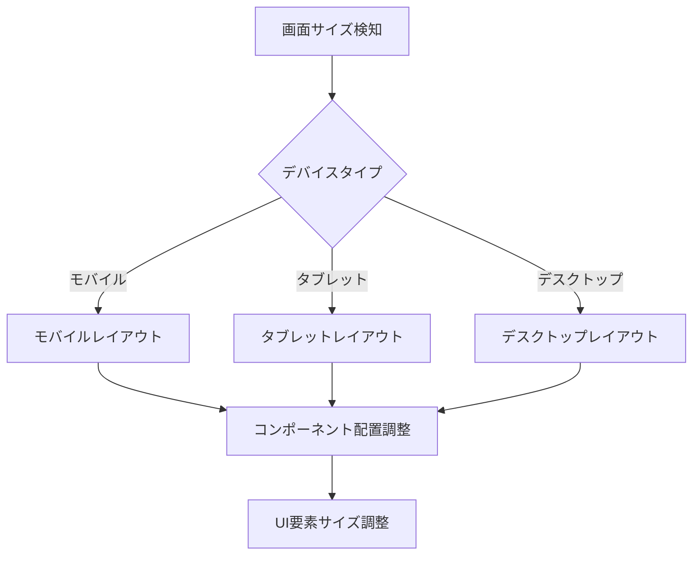
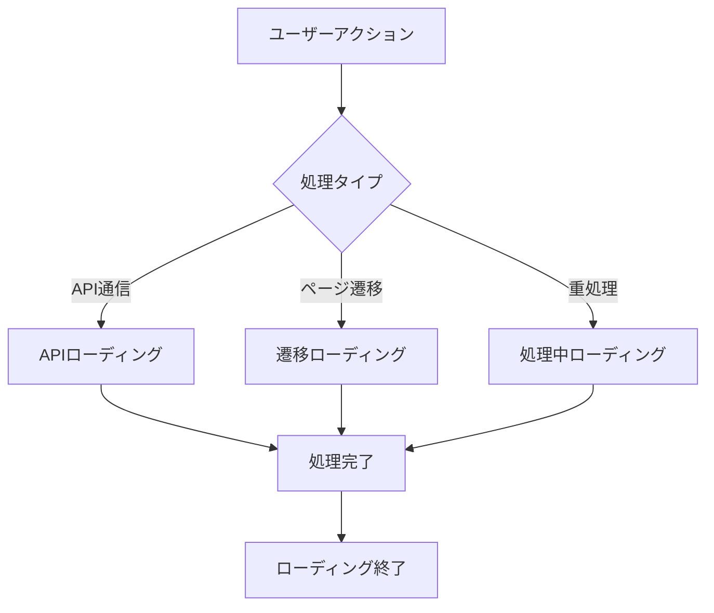

# Fortune Telling App 画面遷移図

## 1. 認証フロー（MVP優先実装）

```mermaid
graph TD
    A[ホームページ] --> B{ログイン済み?}
    B -->|No| C[ログインページ]
    B -->|Yes| D[占い選択ページ]
    C --> E[新規登録ページ]
    C --> F[パスワードリセット]
    F --> G[メール送信]
    G --> H[リセットトークン検証]
    H --> I[新パスワード設定]
    E --> J[個人情報登録]
    J --> D
    C --> |ログイン成功| D
```

## 2. メインフロー（MVP優先実装）

```mermaid
graph TD
    A[占い選択ページ] --> B{占いタイプ選択}
    B --> C[タロット占い]
    B --> D[星占い]
    C & D --> E[占い実行]
    E --> F[結果表示]
    F --> G[結果保存]
    G --> H[結果エクスポート]
    H --> I{エクスポート形式}
    I -->|PDF| J[PDF出力]
    I -->|JSON| K[JSON出力]
```

## 3. 結果管理フロー（MVP優先実装）

```mermaid
graph TD
    A[結果一覧] --> B{表示フィルター}
    B -->|タロット| C[タロット結果]
    B -->|星占い| D[星占い結果]
    C & D --> E[詳細表示]
    E --> F[エクスポート]
    F --> G[バックアップ]
```

## 4. エラーハンドリングフロー（MVP優先実装）

```mermaid
graph TD
    A[任意のページ] --> B{認証チェック}
    B -->|未認証| C[ログインページ]
    B -->|認証済み| D{セッション有効?}
    D -->|無効| E[セッション再取得]
    D -->|有効| F[要求されたページ]
    F --> G{API通信}
    G -->|成功| H[データ表示]
    G -->|失敗| I[エラー表示]
```

## 5. レスポンシブ対応フロー（MVP優先実装）

```mermaid
graph TD
    A[画面サイズ検知] --> B{デバイスタイプ}
    B -->|モバイル| C[モバイルレイアウト]
    B -->|タブレット| D[タブレットレイアウト]
    B -->|デスクトップ| E[デスクトップレイアウト]
    C & D & E --> F[コンポーネント配置調整]
    F --> G[UI要素サイズ調整]
```

## 6. ローディング表示フロー（MVP優先実装）

```mermaid
graph TD
    A[ユーザーアクション] --> B{処理タイプ}
    B -->|API通信| C[APIローディング]
    B -->|ページ遷移| D[遷移ローディング]
    B -->|重処理| E[処理中ローディング]
    C & D & E --> F[処理完了]
    F --> G[ローディング終了]
``` 